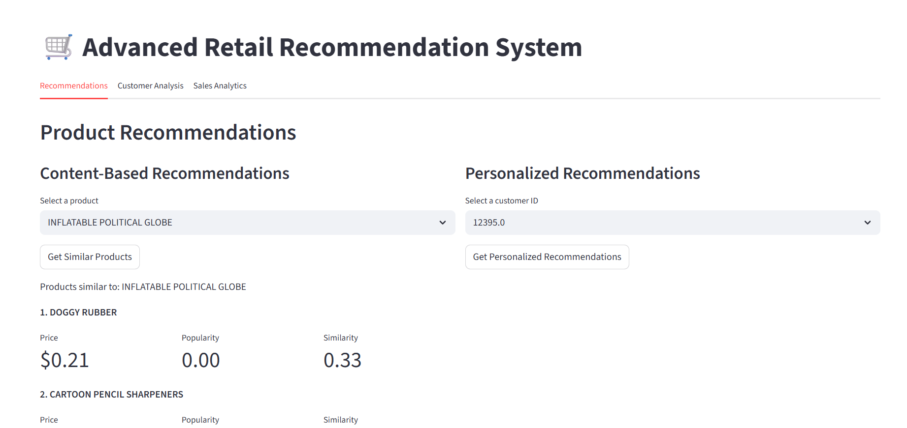
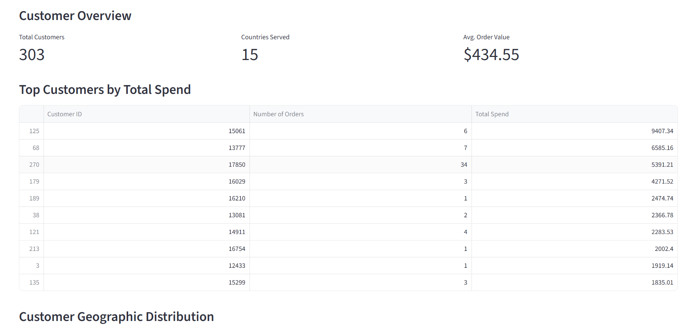
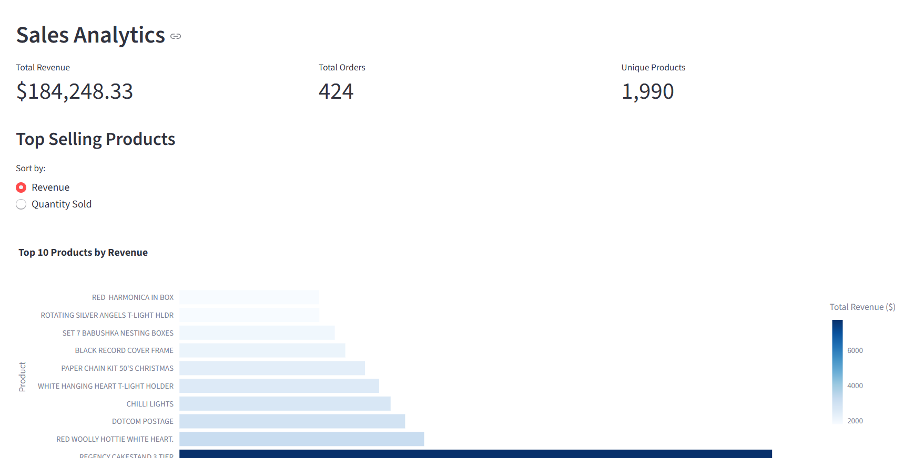

# 🛍️ Online Product Recommendation System

An interactive web application that recommends products to users based on their preferences and historical behavior. Built using Python and Streamlit, the app leverages machine learning models for content-based and collaborative filtering recommendations.

## 💡 Overview

This project demonstrates how machine learning can personalize user experiences in e-commerce. Users receive dynamic product suggestions using their past behavior, preferences, or selected filters. The application is simple to use and runs entirely in the browser.

## 🧰 Tech Stack

- **Frontend**: [Streamlit](https://streamlit.io/)
- **Backend/ML**: Python, Scikit-learn
- **Libraries**: NumPy, Pandas

## 🚀 Features

- 🔍 Product recommendations based on user selection
- 🎯 Content-based filtering using product similarity
- 📊 Clean, responsive UI with Streamlit

---

## 📸 Screenshots

### 🔮 Product Recommendation Interface

### 👥 Customer Analysis Dashboard

### 📈 Sales Analysis Dashboard

